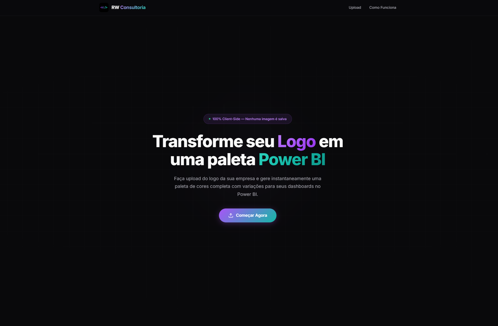
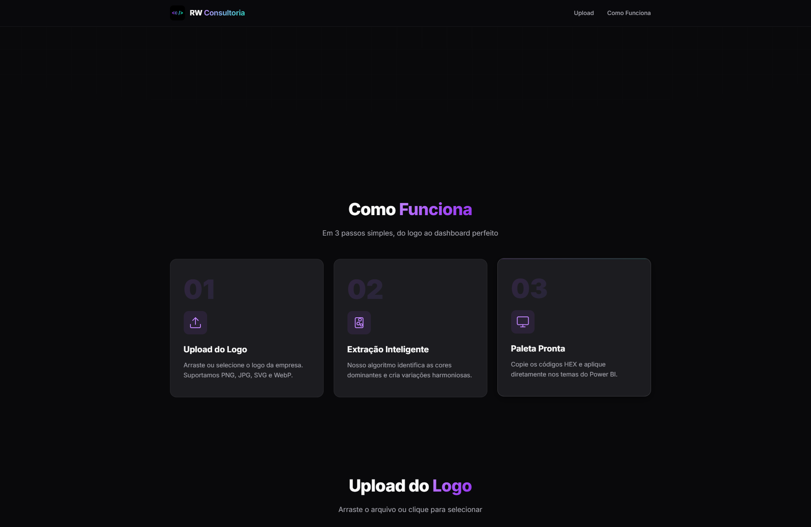
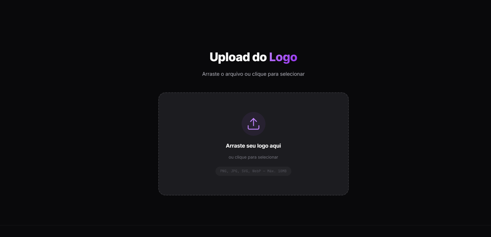

<p align="center">
  
</p>

<h1 align="center">PBI Palette</h1>

<p align="center">
  <strong>Gerador de Paletas de Cores para Power BI</strong><br>
  Desenvolvido por <a href="#">RW Consultoria</a>
</p>

<p align="center">
  
  
  
  
</p>

---

## 📋 Sobre o Projeto

**PBI Palette** é uma plataforma web desenvolvida pela **RW Consultoria** que permite extrair automaticamente as cores dominantes do logo de uma empresa e gerar uma paleta de cores completa, pronta para uso em dashboards do Power BI.

A ferramenta funciona **100% no navegador (client-side)** — nenhuma imagem é enviada para servidores ou armazenada. O processamento de cores acontece instantaneamente usando algoritmos de clusterização K-Means++.

<p align="center">
  
</p>

---

## ✨ Funcionalidades

| Funcionalidade | Descrição |
|---|---|
| 🖼️ **Upload de Logo** | Suporte a PNG, JPG, SVG e WebP (drag & drop ou clique) |
| 🎨 **Extração Inteligente** | Algoritmo K-Means++ identifica as cores dominantes do logo |
| 🎛️ **Cores Configuráveis** | Escolha entre 4, 6, 8 ou 10 cores dominantes |
| 🌈 **Paleta Completa** | Gera 10 variações (50 → 900) de cada cor extraída |
| 🖤 **Cores Neutras** | Backgrounds, textos e bordas calculados a partir do logo |
| 📋 **Copiar com 1 Clique** | Clique em qualquer cor para copiar o código HEX |
| 📦 **Tema Power BI (JSON)** | Exporta o JSON pronto para importar no Power BI Desktop |
| 📊 **Preview de Dashboard** | Visualização simulada com KPIs, gráficos de barras e donut |
| 🔒 **100% Privado** | Nenhuma imagem é salva ou enviada — tudo roda no navegador |

---

## 🖥️ Screenshots

<p align="center">
  
</p>

<p align="center">
  <em>Seção "Como Funciona" — 3 passos simples do logo à paleta</em>
</p>

<br/>

<p align="center">
  
</p>

<p align="center">
  <em>Área de Upload — Drag & Drop ou clique para selecionar</em>
</p>

---

## 🚀 Como Usar

### Pré-requisitos

- Um navegador moderno (Chrome, Edge, Firefox, Safari)
- **Nenhuma instalação necessária** para uso básico

### Opção 1 — Abrir direto no navegador

Basta abrir o arquivo `index.html` diretamente no navegador:

```
index.html
```

### Opção 2 — Servir localmente (recomendado)

Para melhor compatibilidade com upload de imagens:

```bash
# Com npx (Node.js necessário)
npx -y serve .

# Acesse http://localhost:3000
```

### Passo a Passo

1. **Acesse** a plataforma no navegador
2. **Arraste** ou **selecione** o logo da empresa
3. **Escolha** a quantidade de cores dominantes (4, 6, 8 ou 10)
4. **Clique** em **"Gerar Paleta"**
5. **Copie** as cores individualmente ou **baixe** o tema JSON completo
6. **Importe** o JSON no Power BI Desktop em: `Exibir → Temas → Procurar temas`

---

## 📁 Estrutura do Projeto

```
cores-logo/
├── index.html           # Página principal (Landing Page)
├── style.css            # Design system com tema escuro premium
├── color-extractor.js   # Engine de extração de cores (K-Means++)
├── app.js               # Lógica da aplicação
├── image/
│   └── logo.jpg         # Logo da RW Consultoria
├── assets/
│   ├── screenshot-hero.png
│   ├── screenshot-steps.png
│   └── screenshot-upload.png
└── README.md            # Este arquivo
```

---

## 🛠️ Tecnologias

| Tecnologia | Uso |
|---|---|
| **HTML5** | Estrutura semântica da página |
| **CSS3** | Design system com variáveis CSS, glassmorphism e animações |
| **JavaScript (ES6+)** | Lógica de extração de cores e renderização |
| **Canvas API** | Leitura de pixels da imagem |
| **K-Means++ Clustering** | Algoritmo de agrupamento para extração de cores dominantes |
| **Google Fonts (Inter + JetBrains Mono)** | Tipografia moderna |

---

## 🎨 Como Funciona o Algoritmo

1. **Carregamento**: A imagem é carregada em um `<canvas>` redimensionado para performance
2. **Filtragem**: Pixels transparentes, brancos puros e pretos puros são descartados
3. **Inicialização K-Means++**: Centros iniciais são escolhidos de forma inteligente para melhor convergência
4. **Clusterização**: Pixels são agrupados iterativamente aos centros mais próximos
5. **Deduplicação**: Cores muito similares são unificadas
6. **Variações HSL**: Cada cor dominante gera 10 shades (50–900) via manipulação de matiz, saturação e luminosidade
7. **Neutros**: Backgrounds e cores de texto são calculados com base na matiz média das cores dominantes

---

## 📊 Importando o Tema no Power BI

1. Abra o **Power BI Desktop**
2. Vá em **Exibir** → **Temas** → **Procurar temas...**
3. Selecione o arquivo `power-bi-theme.json` baixado
4. As cores serão aplicadas automaticamente a todos os visuais

> **Dica:** O tema inclui `dataColors`, `tableAccent`, cores para semáforos (bom/neutro/ruim) e estilos visuais padrão.

---

## 🔒 Privacidade e Segurança

- ✅ **Nenhuma imagem é enviada** para servidores externos
- ✅ **Nenhum dado é armazenado** — sem cookies, sem banco de dados
- ✅ **Processamento 100% local** — tudo acontece no navegador do usuário
- ✅ **Sem dependências externas** — funciona offline após carregamento

---

## 📄 Licença

Este projeto é proprietário da **RW Consultoria**. Todos os direitos reservados.

---

<p align="center">
  
  <br/>
  <strong>RW Consultoria</strong><br/>
  <sub>Transformando dados em decisões inteligentes</sub>
</p>
